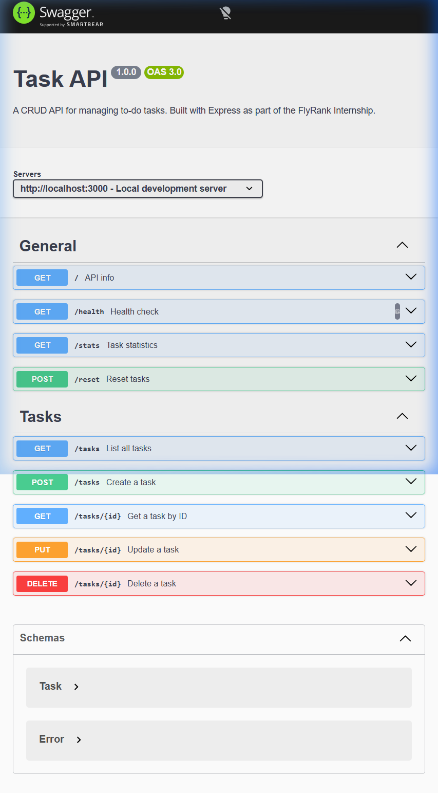

# Task API — CRUD To-Do List

A complete CRUD API for managing to-do tasks, built with **Node.js** and **Express**. Data lives in memory (no database) — restart the server and it's gone. That's the lesson, not a bug.

> **One command** starts everything: `npm start`

---

## Quick Start

### Prerequisites

- [Node.js](https://nodejs.org/) (v18 or higher)

### Install & Run

```bash
# Clone the repo and enter the project
cd "1st Assignment"

# Install dependencies
npm install

# Start the server
npm start
```

The API is live at **http://localhost:3000**
Swagger UI is at **http://localhost:3000/docs**

For development with auto-restart:

```bash
npm run dev
```

---

## API Endpoints

### General

| Method | Path      | Description                        |
|--------|-----------|------------------------------------|
| GET    | `/`       | API metadata (name, version, endpoints) |
| GET    | `/health` | Health check — is the server alive? |
| GET    | `/stats`  | Task statistics (total, done, open) |
| POST   | `/reset`  | Reset tasks to the 3 defaults      |

### Tasks — Full CRUD

| Method | Path          | Status Codes | Description                |
|--------|---------------|--------------|----------------------------|
| GET    | `/tasks`      | 200          | List all tasks             |
| GET    | `/tasks/:id`  | 200 / 404    | Get one task by ID         |
| POST   | `/tasks`      | 201 / 400    | Create a new task          |
| PUT    | `/tasks/:id`  | 200 / 400 / 404 | Update a task           |
| DELETE | `/tasks/:id`  | 204 / 404    | Delete a task              |

### Query Parameters (optional extras)

| Parameter | Example               | Description                          |
|-----------|-----------------------|--------------------------------------|
| `done`    | `/tasks?done=true`    | Filter by completion status          |
| `search`  | `/tasks?search=milk`  | Search tasks by title (case-insensitive) |

---

## Status Codes

| Code | Meaning       | When it's used                          |
|------|---------------|-----------------------------------------|
| 200  | OK            | Successful read or update               |
| 201  | Created       | New task created via POST               |
| 204  | No Content    | Task deleted — success, nothing to say  |
| 400  | Bad Request   | Missing or empty title, invalid body    |
| 404  | Not Found     | Task with that ID doesn't exist         |

---

## Example `curl -i` Output

### Create a task (201 Created)

```
> curl -i -X POST http://localhost:3000/tasks -H "Content-Type: application/json" -d '{"title":"Buy milk"}'

HTTP/1.1 201 Created
Content-Type: application/json; charset=utf-8

{"id":4,"title":"Buy milk","done":false}
```

### Get a task (200 OK)

```
> curl -i http://localhost:3000/tasks/1

HTTP/1.1 200 OK
Content-Type: application/json; charset=utf-8

{"id":1,"title":"Learn Express basics","done":false}
```

### Task not found (404)

```
> curl -i http://localhost:3000/tasks/99

HTTP/1.1 404 Not Found
Content-Type: application/json; charset=utf-8

{"error":"Task 99 not found"}
```

### Validation error (400 Bad Request)

```
> curl -i -X POST http://localhost:3000/tasks -H "Content-Type: application/json" -d '{}'

HTTP/1.1 400 Bad Request
Content-Type: application/json; charset=utf-8

{"error":"Title is required"}
```

### Update a task (200 OK)

```
> curl -i -X PUT http://localhost:3000/tasks/1 -H "Content-Type: application/json" -d '{"done":true}'

HTTP/1.1 200 OK
Content-Type: application/json; charset=utf-8

{"id":1,"title":"Learn Express basics","done":true}
```

### Delete a task (204 No Content)

```
> curl -i -X DELETE http://localhost:3000/tasks/1

HTTP/1.1 204 No Content
```

---

## Swagger UI

Interactive API documentation is available at **http://localhost:3000/docs**.

Every endpoint is listed with descriptions, request/response schemas, and a **"Try it out"** button that sends real requests.



---

## Optional Extras

### ✅ Filtering with query parameters

```bash
# Only completed tasks
curl http://localhost:3000/tasks?done=true

# Only open tasks
curl http://localhost:3000/tasks?done=false
```

### ✅ Search

```bash
# Find tasks with "Express" in the title
curl http://localhost:3000/tasks?search=express
```

### ✅ Stats endpoint

```bash
curl http://localhost:3000/stats
# → {"total":3,"done":1,"open":2}
```

### ✅ Seed & reset

```bash
curl -X POST http://localhost:3000/reset
# → Restores the 3 default tasks
```

### ✅ The mortality experiment

Created 2 new tasks, restarted the server, ran `GET /tasks` — only the original 3 seed tasks were there. The new tasks were gone.

**Why?** The tasks live in a JavaScript variable (`let tasks = [...]`). When Node.js stops, all variables are destroyed. The program starts fresh with only the hardcoded seed data. This is exactly why databases exist — they persist data to disk so it survives restarts.

---

## Project Structure

```
1st Assignment/
├── server.js          # Express app — all CRUD routes (~130 lines)
├── openapi.json       # OpenAPI 3.0 spec for Swagger UI
├── package.json       # Dependencies and scripts
├── swagger-ui.png     # Screenshot for this README
├── .gitignore
└── README.md
```

---

## Author

**Tushar Jain** — FlyRank Internship, Assignment 1
